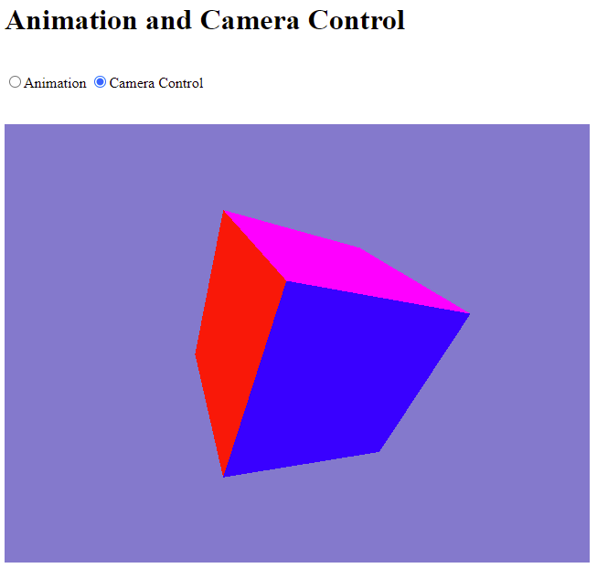

# Step-by-Step WebGPU Graphics Programming (10) 
## Create Cube with Distinct Face Color 

This is the source code for the 9th part of a series YouTube videos on step-by-step WebGPU graphics programming.

This sample WebGPU app creates a square using index buffer. The output from the app is shown in the following image.

